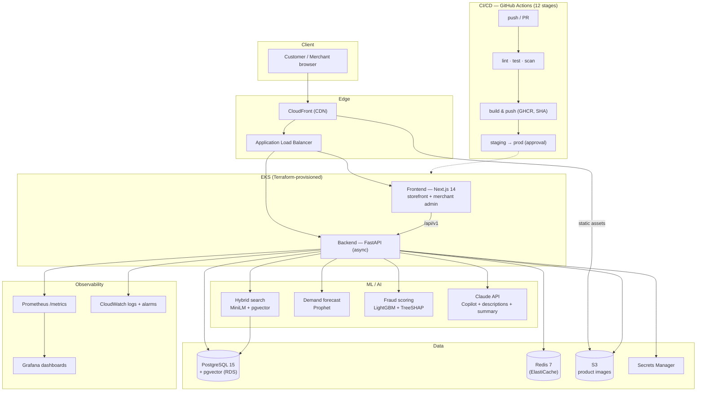

# ShopFlow — AI-Powered E-Commerce Platform

> Emumba GenAI Upskilling Assignment | 8-Week Project | 480 Points

---

## Architecture



> Cloud infra (EKS, RDS, ElastiCache, S3, CloudFront, Secrets Manager,
> CloudWatch) is defined in Terraform under `infrastructure/` and validated
> offline — **not applied**, per the free-tier constraint (see
> `docs/aws-free-tier.md`). Locally the whole stack runs via `docker compose`.

## Tech Stack

| Layer | Choice |
|-------|--------|
| Backend | Python 3.11 + FastAPI |
| Database | PostgreSQL 15 + pgvector |
| Cache | Redis 7 |
| Frontend | Next.js 14 + TypeScript + Tailwind |
| ML | Prophet + LightGBM + Claude API |
| CI/CD | GitHub Actions |
| Cloud | AWS (Terraform) |
| Monitoring | Prometheus + Grafana |

## Quick Start

```bash
git clone <repo-url> && cd shopflow
cp env.example .env   # Fill in your values
docker compose up
```

App: http://localhost:3000 | API docs: http://localhost:8000/docs | Grafana: http://localhost:3001

## Running Tests

```bash
cd backend
pip install -r requirements.txt
pytest tests/ --cov=app --cov-report=term-missing
```

## Features

- Semantic product search (pgvector + sentence-transformers)
- Demand forecasting with restock alerts (Prophet)
- Fraud detection at checkout (LightGBM + SHAP)
- Merchant Copilot — natural language business analytics (Claude API)
- AI product description generator

## Prompt Log

See [PROMPT_LOG.md](PROMPT_LOG.md) — documents every AI prompt used across all 6 domains.

## Known Issues / Work in Progress

*(Update this section as you go)*

## Cost Estimate

*(Add infracost output here in Week 5)*
