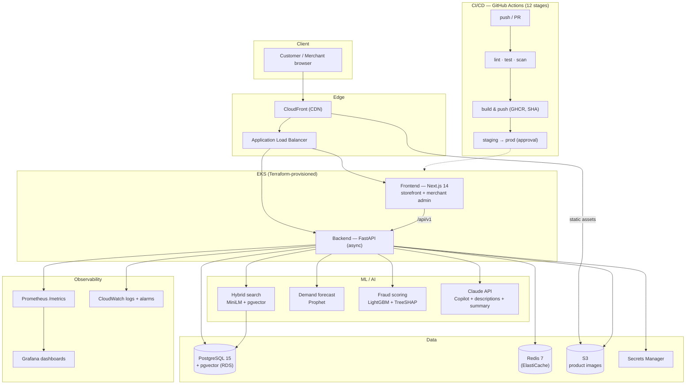

# ShopFlow — AI-Powered E-Commerce Platform

---

## Architecture



> Cloud infra (EKS, RDS, ElastiCache, S3, CloudFront, Secrets Manager,
> CloudWatch) is defined in Terraform under `infrastructure/` and validated
> offline — **not applied**, per the free-tier constraint (see
> `docs/aws-free-tier.md`). Locally the whole stack runs via `docker compose`.

## Tech Stack

| Layer | Choice |
|-------|--------|
| Backend | Python 3.11 + FastAPI |
| Database | PostgreSQL 15 + pgvector |
| Cache | Redis 7 |
| Frontend | Next.js 14 + TypeScript + Tailwind |
| ML | Prophet + LightGBM + Claude API |
| CI/CD | GitHub Actions |
| Cloud | AWS (Terraform) |
| Monitoring | Prometheus + Grafana |

## Quick Start

```bash
git clone <repo-url> && cd shopflow
cp env.example .env   # Fill in your values
docker compose up
```

App: http://localhost:3000 | API docs: http://localhost:8000/docs | Grafana: http://localhost:3001

## Running Tests

```bash
cd backend
pip install -r requirements.txt
pytest tests/ --cov=app --cov-report=term-missing
```

## Features

- Semantic product search (pgvector + sentence-transformers)
- Demand forecasting with restock alerts (Prophet)
- Fraud detection at checkout (LightGBM + SHAP)
- Merchant Copilot — natural language business analytics (Claude API)
- AI product description generator

## Prompt Log

See [PROMPT_LOG.md](PROMPT_LOG.md) — documents every AI prompt used across all 6 domains.

## Deviations from the PRD

Per the PRD ("Any deviation must be noted in your README with justification"):

- **No product variant system (PRD §2.2 "variant selector").** The data model (PRD §1.2) defines no variant entity — products are single-SKU with a quantity stepper. Building a variant system (schema, inventory per variant, cart/checkout changes) was judged out of scope for the 6-week window; the product detail page implements everything else in §2.2 (gallery/zoom, stock indicator, reviews histogram, AI summary).
- **ALB is not a Terraform module (PRD §4.2).** The ALB is created at deploy time by the AWS Load Balancer Controller from the Kubernetes `Ingress` (`k8s/ingress.yaml`) — the idiomatic EKS pattern. Managing it in both Terraform and the controller would fight over the same resource. Target groups, health checks, and listeners are all defined on the Ingress.
- **`terraform apply` posture: validated, never applied.** Owner constraint is free tiers only; EKS control plane (~$73/mo) + NAT are never free. The stack passes `terraform fmt`/`validate` and `kubeconform -strict`; `docs/aws-free-tier.md` documents the $0 deployment path actually used.
- **Fraud review threshold 0.6 (PRD §5.4 says 0.7).** On the held-out synthetic set, 0.6 gives precision 0.88 / recall 0.74 — both above the PRD targets (≥0.85 / ≥0.70); at 0.7 recall drops below target. Override via `FRAUD_REVIEW_THRESHOLD` env var (`app/ml/fraud.py`).
- **Synthetic sales seeder defaults to 180 days (PRD §5.3 says 2 years).** 180 days keeps local seeding/CI fast while still exercising seasonality; `--days 730` reproduces the full PRD horizon.
- **Backend image 2.4 GB (PRD §3.3 says < 200 MB).** CPU-only torch + sentence-transformers + Prophet + LightGBM are inherent to serving ML in-process. The frontend image is 199 MB. Mitigation options (ONNX Runtime, ML sidecar) are documented in `docs/devops.md`.
- **Analytics revenue chart is a bar chart (PRD §2.3 says "line chart").** Daily revenue is discrete per-day amounts, which bars represent honestly; the hand-rolled chart family (`Charts.tsx`) keeps the codebase dependency-free. Same data, same axis, different mark.
- **Checkout is 3 steps, not 4 (PRD §2.2: address → shipping → payment → confirmation).** Shipping and payment are consolidated into one "Address & payment" step ("Cart → Address & payment → Confirmation", with a visual step indicator) — there is no real payment provider or shipping-method selection in scope (webhook is mocked per PRD §1.3), so a separate step would be an empty screen.

## Known Issues / Work in Progress

See [docs/stack-audit-2026-07-08.md](docs/stack-audit-2026-07-08.md) for the current per-domain remaining-work list.

## Cost Estimate

*(Add infracost output here in Week 5)*
